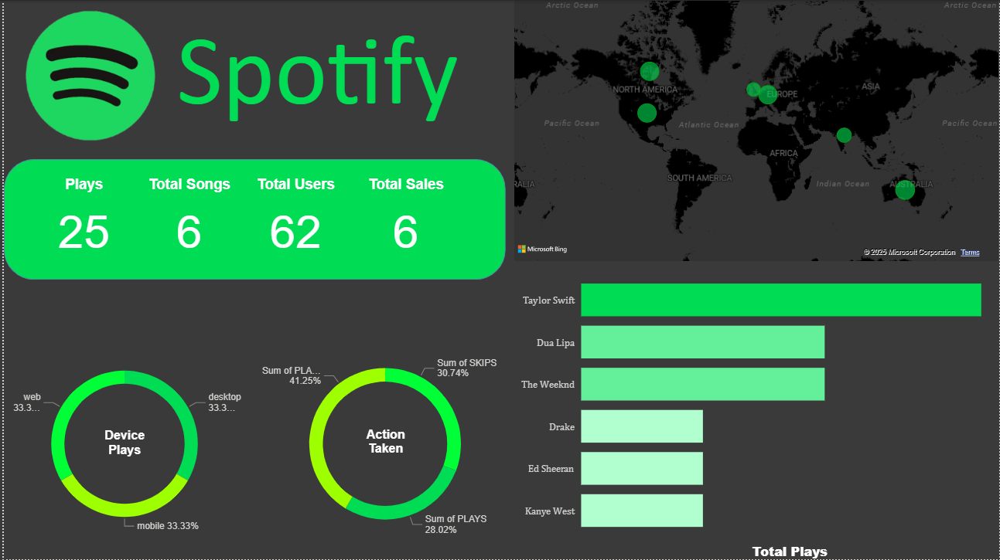

# Spotify MDS Project - Real-Time Kafka > MinIO > Airflow > Snowflake > dbt > Power BI

Transform and analyze simulated Spotify events through a modern data stack. Events are produced to Kafka, landed in MinIO (object storage), loaded into Snowflake via Airflow (Bronze), modeled with dbt (Silver/Gold), and visualized in Power BI.


## What's inside

- Kafka + Zookeeper with Kafdrop UI
- MinIO object storage (S3-compatible)
- Airflow (scheduler + webserver) with DAG to load Bronze in Snowflake
- Snowflake as the warehouse
- dbt project for transformations (Silver/Gold)
- Power BI dashboard

Repository highlights:
- `docker/docker-compose.yml`: services (Kafka/ZK, Kafdrop, MinIO, Airflow, Postgres)
- `docker/dags/minio-to-kafka.py`: Airflow DAG - MinIO to Snowflake (Bronze)
- `consumer/kafka-to-minio.py`: Kafka consumer batches events into MinIO
- `simulator/producer.py`: Synthetic event generator to Kafka
- `spotify_dbt/spotify_dbt/`: dbt project with profiles and models
- `images/diagram.png`: Solution diagram
- `images/final.png`: Power BI final dashboard screenshot

## Prerequisites

- Windows with Docker Desktop
- Python 3.10+ (for producer/consumer)
- Power BI Desktop (for visualization)
- A Snowflake account and warehouse

## Quick start

1) Clone and open the project

```pwsh
# in pwsh
cd C:\\Users\\sonik
git clone <your-repo-url> spotify-mds-project
cd spotify-mds-project
```

2) Create local config from templates (don't commit secrets)

```pwsh
# Root app config for producer/consumer
Copy-Item .env.example .env -ErrorAction SilentlyContinue

# Airflow DAG env for containers
Copy-Item docker\\dags\\.env.example docker\\dags\\.env -ErrorAction SilentlyContinue

# dbt profile (lives next to dbt_project.yml). Keep the real one OUT of git.
Copy-Item spotify_dbt\\spotify_dbt\\profiles.template.yml spotify_dbt\\spotify_dbt\\profiles.yml -ErrorAction SilentlyContinue
```

3) Fill in credentials (Snowflake, MinIO, etc.)

- Edit `.env` and `docker/dags/.env` with your values.
- Edit `spotify_dbt/spotify_dbt/profiles.yml` with your Snowflake account.
- Optional placeholder file for your records only: `docs/credentials.template.json` contains fields named "userr id" and "password" (as requested). Do not use it in code.

4) Start the stack

```pwsh
cd docker
docker compose up -d
```

Services (default ports):
- Airflow Webserver: http://localhost:8080
- Kafdrop (Kafka UI): http://localhost:9000
- MinIO Console: http://localhost:9001 (S3 API on http://localhost:9002)

5) Generate events (producer)

```pwsh
# in repo root
pip install -r requirements.txt
$env:KAFKA_BOOTSTRAP_SERVERS = "localhost:29092"  # external listener from docker-compose
$env:KAFKA_TOPIC = "spotify-events"
python .\\simulator\\producer.py
```

6) Land events to MinIO (consumer)

Open a new terminal so the producer keeps running:

```pwsh
# in repo root
$env:KAFKA_BOOTSTRAP_SERVER = "localhost:29092"
$env:KAFKA_TOPIC = "spotify-events"
$env:KAFKA_GROUP_ID = "spotify-consumer"
$env:MINIO_ENDPOINT = "http://localhost:9002"
$env:MINIO_ACCESS_KEY = "<your-minio-access-key>"
$env:MINIO_SECRET_KEY = "<your-minio-secret-key>"
$env:MINIO_BUCKET = "spotify"
python .\\consumer\\kafka-to-minio.py
```

The consumer writes newline-delimited JSON batches under `bronze/date=YYYY-MM-DD/hour=HH/...` in MinIO.

7) Load Bronze in Snowflake (Airflow)

- Airflow UI -> login with the admin you set in compose env.
- Enable and trigger DAG `spotify_minio_to_snowflake_bronze`.
- The DAG reads from MinIO and inserts into `SNOWFLAKE_DATABASE.SNOWFLAKE_SCHEMA.SNOWFLAKE_TABLE`.

8) Transform with dbt (Silver/Gold)

```pwsh
cd .\\spotify_dbt\\spotify_dbt
# make sure profiles.yml is properly filled with Snowflake creds
python -m pip install -r ..\\..\\requirements.txt
# optional sanity check
python -m dbt --help > $null
# run transformations
python -m dbt debug
python -m dbt deps
python -m dbt run
```

9) Visualize in Power BI

- Connect Power BI to Snowflake (same database/warehouse; use your account).
- Import the Gold models as tables/views.
- Use `images/final.png` as a reference for the dashboard layout.



## Configuration reference

Producer (`simulator/producer.py`)
- KAFKA_BOOTSTRAP_SERVERS (e.g., localhost:29092)
- KAFKA_TOPIC (default: spotify-events)
- USER_COUNT (default: 20)
- EVENT_INTERVAL_SECONDS (default: 1)

Consumer (`consumer/kafka-to-minio.py`)
- KAFKA_BOOTSTRAP_SERVER (localhost:29092)
- KAFKA_TOPIC, KAFKA_GROUP_ID
- MINIO_ENDPOINT (localhost:9002)
- MINIO_ACCESS_KEY, MINIO_SECRET_KEY
- MINIO_BUCKET (e.g., spotify)
- BATCH_SIZE (default: 10)

Airflow DAG env (`docker/dags/.env` read inside container)
- MINIO_ENDPOINT (http://minio:9000 from container)
- MINIO_ACCESS_KEY, MINIO_SECRET_KEY, MINIO_BUCKET, MINIO_PREFIX (e.g., bronze/)
- SNOWFLAKE_USER, SNOWFLAKE_PASSWORD, SNOWFLAKE_ACCOUNT, SNOWFLAKE_WAREHOUSE,
  SNOWFLAKE_DATABASE, SNOWFLAKE_SCHEMA, SNOWFLAKE_TABLE
- LOCAL_TEMP_PATH (default: /tmp/spotify_raw.json)

Docker Compose (`docker/docker-compose.yml`)
- Set `MINIO_ROOT_USER`, `MINIO_ROOT_PASSWORD` for the MinIO service
- Postgres + Airflow admin variables for the Airflow services

dbt profile (`spotify_dbt/spotify_dbt/profiles.yml`)
- Type: snowflake
- account, user, password, role, database, warehouse, schema, threads

## Security and secrets

- Do NOT commit real secrets. This repo includes templates only:
  - `.env.example`, `docker/dags/.env.example`, `spotify_dbt/spotify_dbt/profiles.template.yml`, `docs/credentials.template.json`.
- Add your real files locally as `.env`, `docker/dags/.env`, `spotify_dbt/spotify_dbt/profiles.yml`, `docs/credentials.json` — they are ignored by `.gitignore`.
- If you previously committed secrets (e.g., dbt `profiles.yml`), rotate them and use the templates going forward.

## Troubleshooting

- Kafka connectivity: use Kafdrop (http://localhost:9000) to verify topic exists and messages arrive.
- MinIO: log in at http://localhost:9001 and browse object paths under the bucket.
- Airflow: check task logs for `extract_data` and `load_raw_to_snowflake`.
- dbt: run `dbt debug` and confirm profile connectivity to Snowflake.
- Docker: `docker compose logs -f <service>` to tail logs.

## License

MIT (or your preferred license). Update as needed.

---

Professional documentation lives in `docs/Understanding.md` and contains deeper architecture, operations, and extensibility details.
