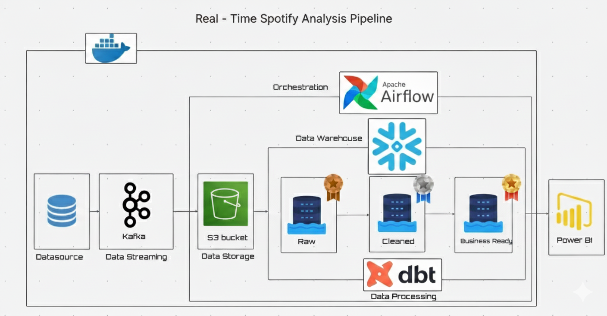

# Spotify MDS Project - Architecture and Operations Guide

This document explains the end-to-end design, configuration, and operations of the Spotify MDS (Modern Data Stack) project. It complements the root `README.md` with deeper details for architecture, schemas, lineage, and day-2 operations.



## 1) Overview

- Real-time simulated Spotify events are produced to Kafka.
- A consumer batches events and lands them in MinIO as newline-delimited JSON (Bronze landing).
- Airflow orchestrates extraction from MinIO and raw inserts into Snowflake Bronze.
- dbt builds Silver/Gold models in Snowflake for analytics.
- Power BI connects to Snowflake and presents dashboards (see `images/final.png`).

## 2) Data flow (step-by-step)

1. Simulator (`simulator/producer.py`) sends JSON events to the Kafka topic (default: `spotify-events`).
2. Consumer (`consumer/kafka-to-minio.py`) reads events in batches and writes objects to MinIO under `bronze/date=YYYY-MM-DD/hour=HH/...`.
3. Airflow DAG (`docker/dags/minio-to-kafka.py`):
	 - Task `extract_data`: reads all `.json` objects from the given MinIO prefix, merges to a temp file.
	 - Task `load_raw_to_snowflake`: inserts each record into a Snowflake Bronze table.
4. dbt (`spotify_dbt/spotify_dbt/`) transforms Bronze into curated Silver/Gold.
5. Power BI connects to Snowflake and visualizes the Gold layer.

## 3) Event schema (Producer output)

Each event resembles:

```json
{
	"event_id": "<uuid>",
	"user_id": "<uuid>",
	"song_id": "<uuid>",
	"artist_name": "The Weeknd",
	"song_name": "Blinding Lights",
	"event_type": "play|pause|skip|add_to_playlist",
	"device_type": "mobile|desktop|web",
	"country": "US|UK|...",
	"timestamp": "2025-10-28T06:15:00Z"
}
```

## 4) Object storage layout (MinIO)

- Bucket: `MINIO_BUCKET` (e.g., `spotify`)
- Prefix: `MINIO_PREFIX` (e.g., `bronze/`)
- Partition-like foldering per consumer: `bronze/date=YYYY-MM-DD/hour=HH/<file>.json`
- Files are newline-delimited JSON (NDJSON) with a batch of events.

## 5) Snowflake Bronze table

The Airflow DAG creates the table if missing and inserts rows:

```sql
CREATE TABLE IF NOT EXISTS <SNOWFLAKE_TABLE> (
	event_id STRING,
	user_id STRING,
	song_id STRING,
	artist_name STRING,
	song_name STRING,
	event_type STRING,
	device_type STRING,
	country STRING,
	timestamp STRING
);
```

Recommended naming to align with `sources.yml`:
- Database: `SPOTIFY_DB`
- Schema: `BRONZE`
- Table: `SPOTIFY_EVENTS_BRONZE`

## 6) Airflow DAG details

- File: `docker/dags/minio-to-kafka.py`
- DAG id: `spotify_minio_to_snowflake_bronze`
- Schedule: `@hourly`
- Tasks: `extract_data` -> `load_raw_to_snowflake`
- Environment file: `docker/dags/.env` (loaded inside container)
- Key variables:
	- MinIO: `MINIO_ENDPOINT` (use `http://minio:9000` inside containers), `MINIO_ACCESS_KEY`, `MINIO_SECRET_KEY`, `MINIO_BUCKET`, `MINIO_PREFIX`
	- Snowflake: `SNOWFLAKE_USER`, `SNOWFLAKE_PASSWORD`, `SNOWFLAKE_ACCOUNT`, `SNOWFLAKE_WAREHOUSE`, `SNOWFLAKE_DATABASE`, `SNOWFLAKE_SCHEMA`, `SNOWFLAKE_TABLE`

## 7) Kafka & networking notes

- Kafka external listener: `localhost:29092` (from Docker Compose) for local apps.
- Internal container listener: `kafka:9092` for services within the docker network.
- Use Kafdrop (http://localhost:9000) to observe topics and partitions.

## 8) dbt project

- Project root: `spotify_dbt/spotify_dbt/`
- Project file: `dbt_project.yml`
- Profile name: `spotify_dbt` (see `profiles.yml`)
- Macro: `macros/generate_schema_name.sql` forces use of target schema consistently.
- Source declaration: `models/sources.yml` includes Bronze source example.
- Typical run:

```pwsh
cd .\spotify_dbt\spotify_dbt
python -m dbt debug
python -m dbt deps
python -m dbt run
```

## 9) Power BI

- Connect to Snowflake with the same database/warehouse used by dbt.
- Import curated Gold models for reporting.
- See `images/final.png` for the expected dashboard look.

## 10) Configuration and credentials strategy

- Local apps use `.env` (from `.env.example`).
- Airflow uses `docker/dags/.env` (from `.env.example`).
- dbt uses `spotify_dbt/spotify_dbt/profiles.yml` (create from `profiles.template.yml`).
- A placeholder file `docs/credentials.template.json` is provided with fields named "userr id" and "password" per your request (for your private records only; not consumed by code).
- `.gitignore` prevents committing secret-bearing files.

## 11) Operations

Start stack:

```pwsh
cd docker
docker compose up -d
```

Stop stack:

```pwsh
docker compose down
```

Scale producer load: adjust `USER_COUNT` and `EVENT_INTERVAL_SECONDS` in `.env` before running the simulator.

Rotate credentials: update `.env`, `docker/dags/.env`, and `profiles.yml`. Never commit real secrets.

## 12) Troubleshooting

- Kafka: no messages in Kafdrop -> check producer terminal for errors; verify `KAFKA_BOOTSTRAP_SERVERS`.
- MinIO: no files -> check consumer env and bucket name; verify `MINIO_ENDPOINT` and keys.
- Airflow: task failures -> open task logs for `extract_data`/`load_raw_to_snowflake`.
- Snowflake: permission errors -> validate role/warehouse; `dbt debug` must pass.
- Ports in use -> stop conflicting services or change mappings in `docker-compose.yml`.

## 13) Next steps

- Add schema validation (e.g., Pydantic or JSONSchema) on the consumer.
- Implement incremental dbt models and snapshots.
- Add CI (pre-commit for SQL/py, dbt tests, and Airflow DAG linting).
- Publish a Power BI template (`.pbit`).